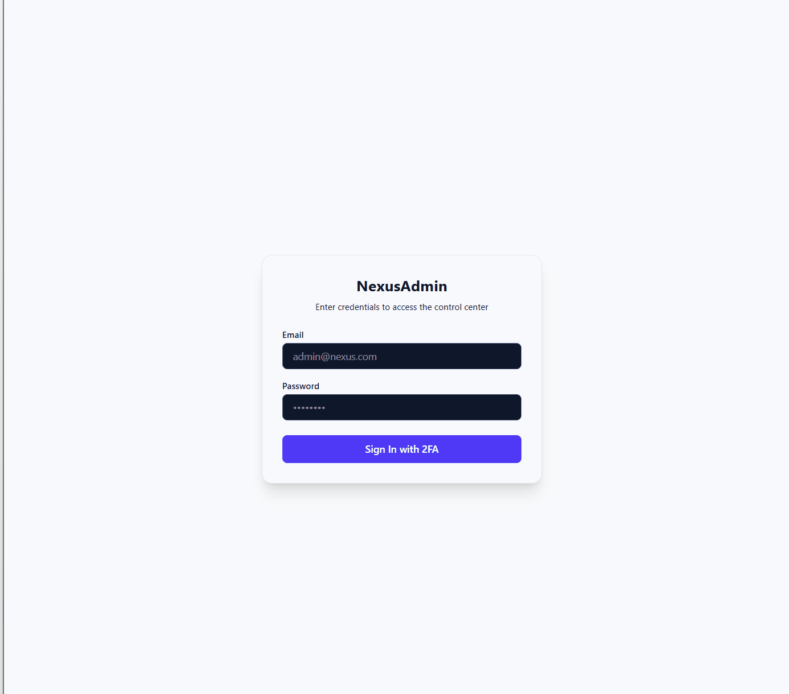

# NexusAdmin | Admin Control Center

NexusAdmin is a modern, responsive full-stack admin dashboard built with the MERN stack (MongoDB, Express, React, Node.js) and Tailwind CSS, featuring robust 2FA security via Resend API and real-time management capabilities.

## 🔗 Live Demo
- **Frontend (Vercel):** [https://nexus-admin-three.vercel.app](https://nexus-admin-three.vercel.app)
- **Backend (Render):** [https://nexus-admin-phbh.onrender.com](https://nexus-admin-phbh.onrender.com)

---

## 🚀 Feature Demonstrations

### 🔐 1. Two-Factor Authentication (2FA via Email OTP)
Secure login flow integrated with Resend API for real-time OTP verification.



---

### 👥 2. Dynamic User Management (CRUD)
Seamless user creation, management, sorting, and filtering capabilities with instant UI updates.


---

## 🛠️ Tech Stack

- **Frontend:** React, Vite, Tailwind CSS, Lucide Icons
- **Backend:** Node.js, Express.js, MongoDB (Mongoose), JWT Authentication, Resend API
- **Deployment:** Vercel (Client), Render (Server)

---

## ✨ Features

- **2FA/OTP Authentication:** Email-based multi-factor authentication using Resend API.
- **Interactive Analytics:** Clean UI metrics and dashboard visualizations.
- **Full CRUD Operations:** Dynamic user management with sorting and filtering options.
- **Responsive Layout:** Optimized across desktop, tablet, and mobile viewports.

---

## ⚙️ Local Installation & Setup

1. **Clone the repository:**
   ```bash
   git clone [https://github.com/jmeherin-dev/nexus-admin.git](https://github.com/jmeherin-dev/nexus-admin.git)
   cd nexus-admin